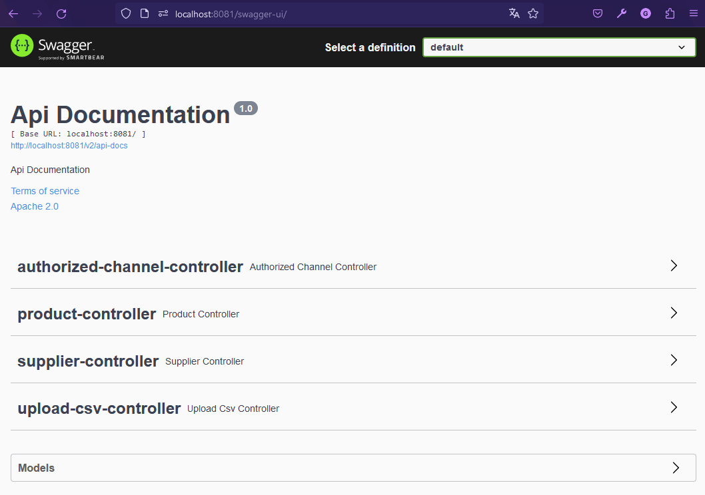
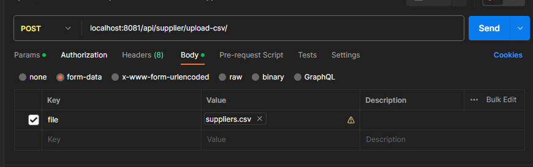
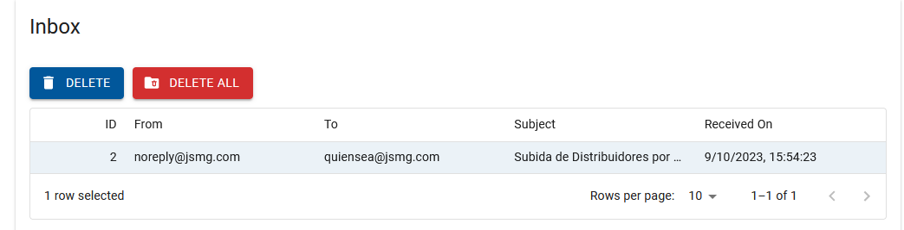

<p align="center">
  <a href="https://spring.io/" target="blank"></a>
</p>

# Platform Backend

1. Clone the repository
2. Run the ```docker-compose.yaml``` for up image DB and PgAdmin
```
    docker-compose up -d
```
3. Run the command line for use the fakeSMTP 
```
    docker run --name smtp -p 5025:8025 -p 5080:8080 -p 5081:8081 -d gessnerfl/fake-smtp-server
```

# PostgreSQL and Pg Admin
## PostgreSQL
1. The image is running in the __port: 5432__
## Pg Admin
1. Go to **localhost:8080/**
2. Enter the user and pass word, is in __docker-compose.yaml__ or change the variables
```
 user: alumno@google.com
 password: 123456
```

# Fake SMTP  gessnerfl/fake-smtp-server


1. The port mapped for SMTP_Port is __5025__
2. View the FakeSMTP interface in: 
```
    http://localhost:5080/
```
3. Can view de documentation in
```
    http://localhost:5080/swagger-ui
```

# API Platform Backend
This application has distributors, products, and authorized distribution channels, each of which has its respective GET, POST, PATCH, DELETE endpoints (CRUD).

### Postman
import the collection in Postman from __platformBackend.postman_collection.json__ for use the endpoints useds

### Swagger 2
You can see the documentation in
```
    http://localhost:8081/swagger-ui/
```


## Suppliers

### Upload CSV File for Charge or Update Suppliers
You can use the __suppliers.csv__ in csvFile directory
Send a POST request and put the file in __from-data__ as 'file'
```
    localhost:8081/api/supplier/upload-csv/
```

when the process is success send an email, in this project received in the inbox the fakeSMTP



# Tools Used

* __Java__
* __SpringBoot__
* __SpringMail__
* __Fake SMTP__: gessnerfl/fake-smtp-server
* __Postgre SQL__
* __Pg Admin__
* __Postman__
* __docker__
* __JUnit__


